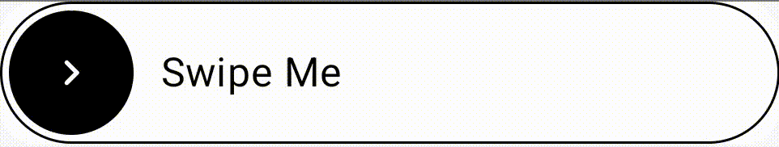
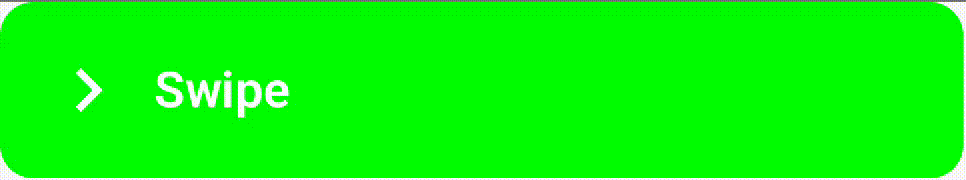
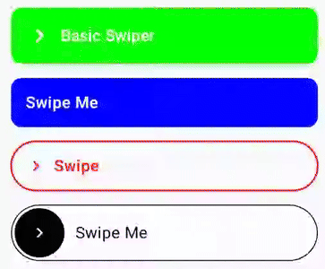

A fully customizable swipe button composable library.  

### Screenshots

### Features
- Fully customizable composable library. Customize animation, swipe behaviour etc. or simply use a basic swiper for read-to-use cases.
- Supports `API 24+`.
- 3 variants for different customization needs: `BasicSwiper`, `ContentSwiper` & `RawSwiper`.
- Add custom drag points via RawSwiper.
- Easy to use!

### Requirements
- API level 24+

📝 Docs & Usage coming soon!
